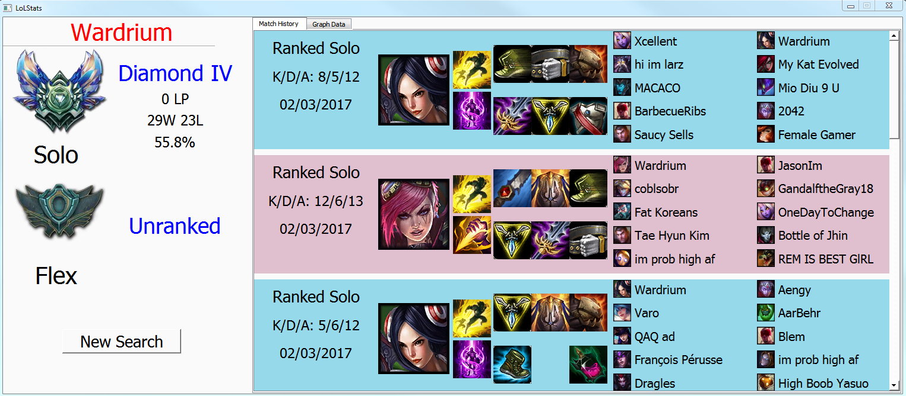
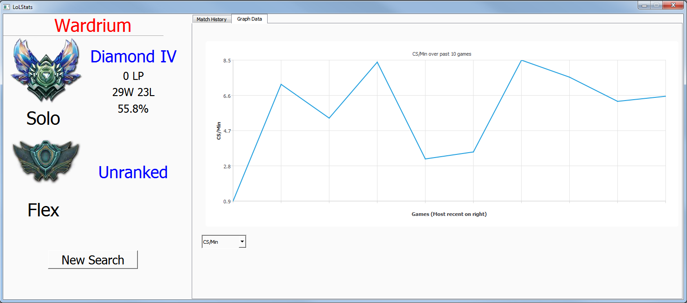

# About
A desktop application for searching data on a League of Legends account. Currently includes match history and a graph view of cs/min, gold/min and KDA plotted over the past 10 games. Queries the official Riot API for the necessary data.

## Installation
Two options:
1. Download the source files and build it yourself. This requires QT installation.
2. Download the release folder and run the executable in it. This is built for x64 windows.

Note: Data sometimes did not load on certain computers I tested it on, likely due to the firewall blocking it from making HTTP requests.

## Screenshots

This is the initial screen. Enter a player's username to search their stats.

After searching a player, this screen appears. It has basic ranked information along with match history.

Can click the "Graph Data" button to plot data from the past 10 games.

## Future Improvements
* Show more than 10 games in match history
* Select which games to graph from match history
* Add more types of data to graph by
* Filter games by type (i.e. ranked, normal)
* Support all the game types (currently only has proper name tags for ranked games, normal games, and twisted treeline games)
* Make interface more visually appealing.